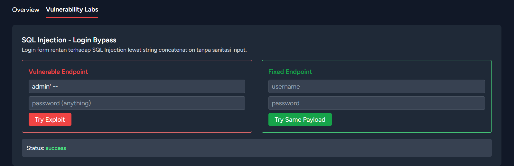
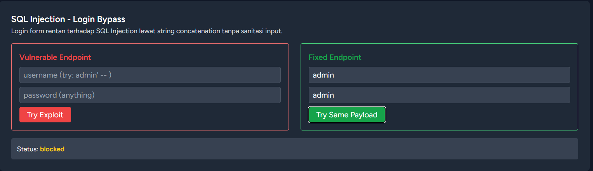

# SQL Injection — Login Bypass

## Vulnerability

Endpoint `/lab/sqli/vulnerable/login` membangun query SQL dengan string concatenation langsung dari input user, tanpa sanitasi atau parameter binding:

```php
$rows = DB::select("SELECT * FROM lab_accounts WHERE username = '$username' AND password = '$password'");
```

## Impact

Penyerang dapat melakukan **authentication bypass** tanpa mengetahui kredensial yang valid, dengan menyisipkan SQL comment (`--`) untuk mengabaikan pengecekan password.

Tingkat keparahan: **Critical** — bypass autentikasi adalah salah satu dampak paling serius dari SQL Injection, karena memberikan akses tidak sah ke akun (termasuk akun admin).

## Proof of Concept

**Payload:** `admin' -- ` pada field username, password dikosongkan.

Query yang ter-eksekusi menjadi:
```sql
SELECT * FROM lab_accounts WHERE username = 'admin' --' AND password = ''
```
Bagian setelah `--` dianggap comment oleh SQL engine, sehingga pengecekan password diabaikan sepenuhnya. Login berhasil sebagai user `admin` tanpa password.

**Hasil:**


## Remediation

Endpoint `/lab/sqli/fixed/login` menggunakan parameter binding (prepared statement):

```php
$rows = DB::select(
    "SELECT * FROM lab_accounts WHERE username = ? AND password = ?",
    [$username, $password]
);
```

Dengan parameter binding, input user diperlakukan sebagai **data literal**, bukan bagian dari struktur SQL — payload yang sama akan dicocokkan sebagai string biasa dan login gagal.

**Hasil setelah fix:**


## Pelajaran

- Jangan pernah membangun query SQL dengan string concatenation dari input user.
- Gunakan Eloquent ORM atau prepared statement (parameter binding) secara konsisten.
- Eloquent Laravel secara default sudah aman dari SQL Injection karena menggunakan parameter binding di belakang layar — vulnerability ini hanya terjadi karena penggunaan `DB::select()` dengan raw string secara sengaja.
